# plotkit

Publication-ready scientific figures in one function call. Built on matplotlib, works with pandas and polars, and designed to be bold, readable and colour-blind safe.

```python
import plotkit

data = plotkit.synthetic.gaussian(mu=2, sigma=0.5)
plotkit.continuous("Value (a.u.)", "Density", "Gaussian distribution", data).save("figure")
```

That writes `figure.png` (300 dpi), cropped and centred with equal padding on all four sides.

<p align="center">
  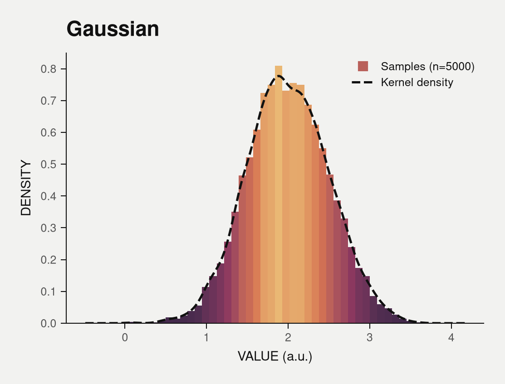
</p>

## Contents

- [Install](#install)
- [Quickstart](#quickstart)
- [Gallery](#gallery)
- [Plot reference](#plot-reference)
- [Styles](#styles)
- [Data: pandas and polars](#data-pandas-and-polars)
- [Saving and customizing](#saving-and-customizing)
- [Extending plotkit](#extending-plotkit)
- [Design rules](#design-rules)
- [Development](#development)
- [Limitations](#limitations)

## Install

plotkit is not on PyPI yet. Install from a clone:

```bash
git clone git@github.com:michael-jopiti/plotkit.git
cd plotkit
uv sync --extra polars          # or: pip install -e ".[polars]"
```

Python 3.10 or newer. Required: `matplotlib>=3.9`, `pandas`, `numpy`.

| Extra | Adds | For |
|---|---|---|
| `polars` | `polars` | polars DataFrames and LazyFrames as input |
| `umap` | `umap-learn` | `dim_red(..., method="umap")` |
| `dev` | pytest, ruff, mypy, colorspacious, scikit-learn, ... | tests and the colour-validation tools |

## Quickstart

Every plot is one call with the same argument order: `plotkit.<kind>(x_name, y_name, title, data, **options)`.

```python
import plotkit
from plotkit import synthetic as syn

# a distribution
plotkit.continuous("Value (a.u.)", "Density", "Gaussian distribution", syn.gaussian(2, 0.5))

# quantiles per group: data is a table with a group column and a value column
plotkit.boxplot("Group", "Value (a.u.)", "Quantiles by group", syn.groups())

# PCA computed for you from a feature table
plotkit.dim_red("PC1", "PC2", "PCA of expression", syn.expression(), hue="group", method="pca")

# survival curves from time / event / group columns
plotkit.survival("Time (months)", "Survival probability", "Overall survival", syn.survival_data())
```

Each call returns a `PlotResult`:

```python
result = plotkit.boxplot("Group", "Value", "Quantiles", syn.groups())
result.fig, result.ax  # matplotlib objects, keep customizing
result.overlaps()  # [] when no text elements collide
result.save("out/boxplot")  # PDF + SVG + PNG
```

In a Jupyter notebook, `plotkit.<kind>(...)` returns the result; use `result.fig` to display it.

Pass your own data instead of `plotkit.synthetic`:

```python
import pandas as pd

df = pd.read_csv("usage.csv")  # columns: region, condition, usage
plotkit.bar("Region", "Usage (%)", "Region usage", df, hue="condition", save="figures/usage")
```

Axis labels are free text and may carry units (`"Time (s)"`). plotkit matches them to column names ignoring case, spaces and the unit, so `"Usage (%)"` finds the column `usage`. When a label does not match a column, name the column explicitly with `x=` and `y=`:

```python
plotkit.bar(
    "Transcript region", "Usage (%)", "Region usage", df, x="region", y="usage", hue="condition"
)
```

## Gallery

All images are generated by [`main.py`](main.py) (`uv run python main.py`), which makes one call per plot. Files are in [`examples/output/`](examples/output/).

<table>
  <tr>
    <td align="center"><br><code>continuous</code></td>
    <td align="center">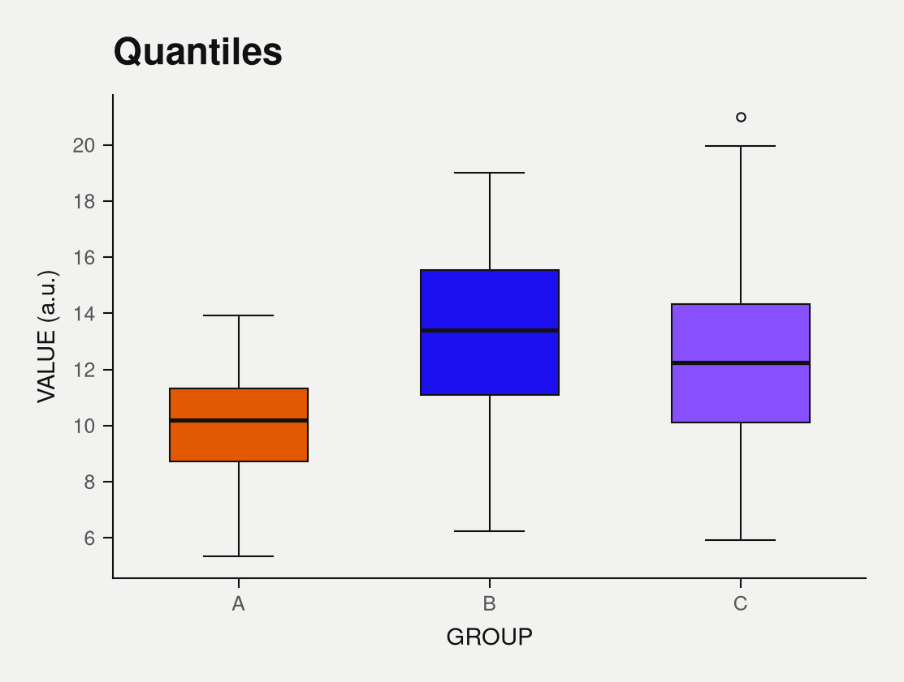<br><code>boxplot</code></td>
    <td align="center">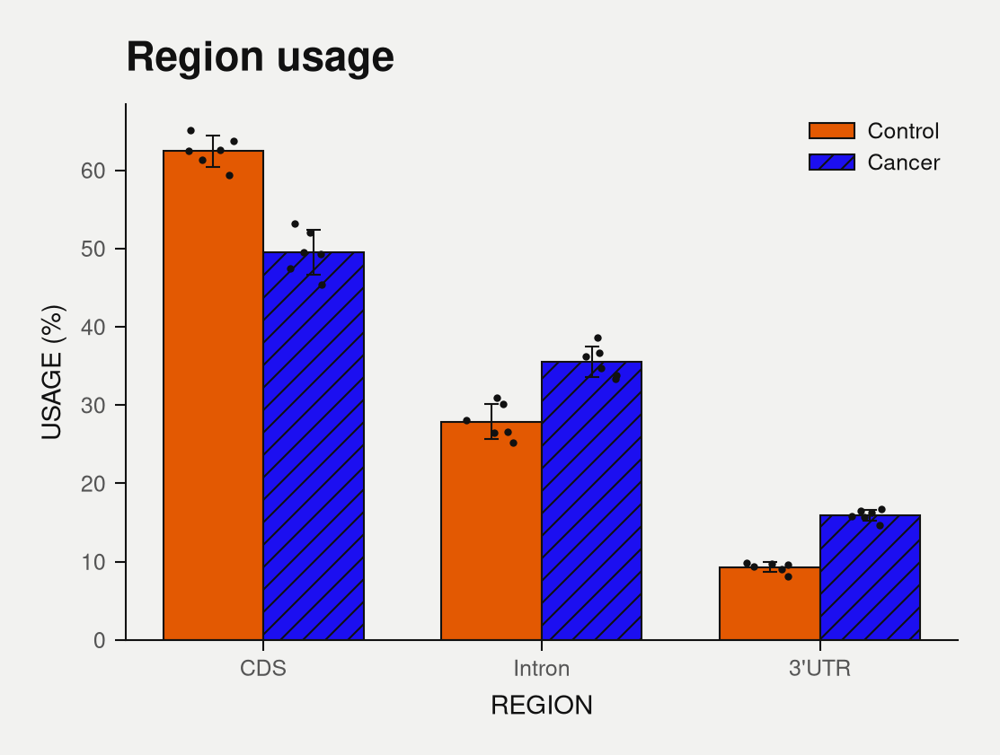<br><code>bar</code></td>
  </tr>
  <tr>
    <td align="center">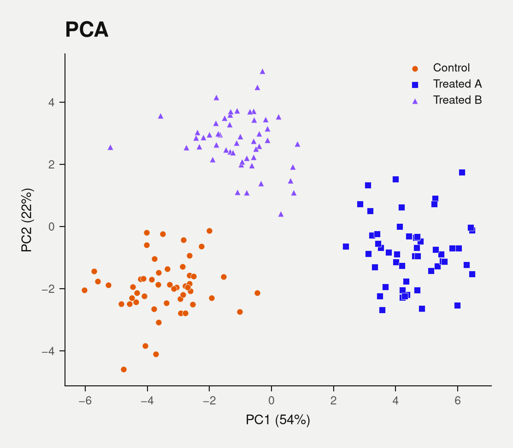<br><code>dim_red</code> (PCA)</td>
    <td align="center">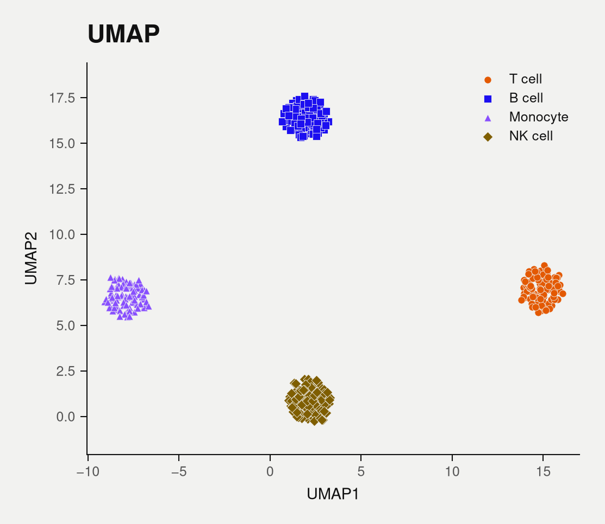<br><code>dim_red</code> (UMAP)</td>
    <td align="center">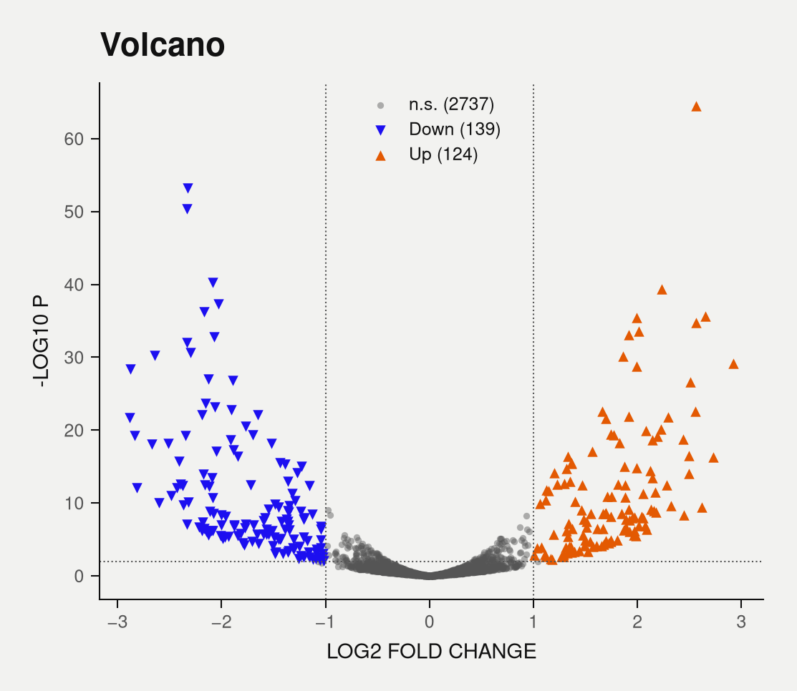<br><code>volcano</code></td>
  </tr>
  <tr>
    <td align="center">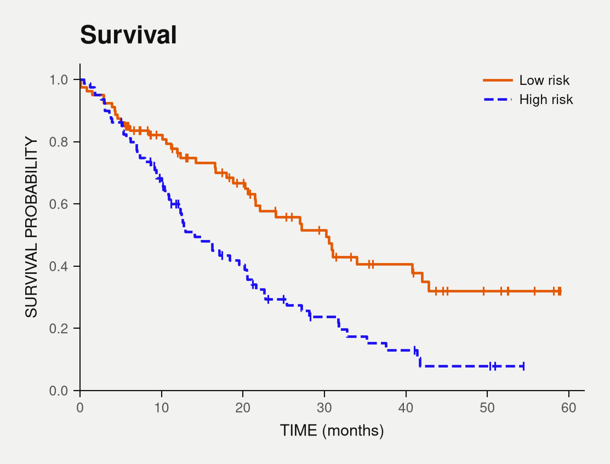<br><code>survival</code></td>
    <td align="center">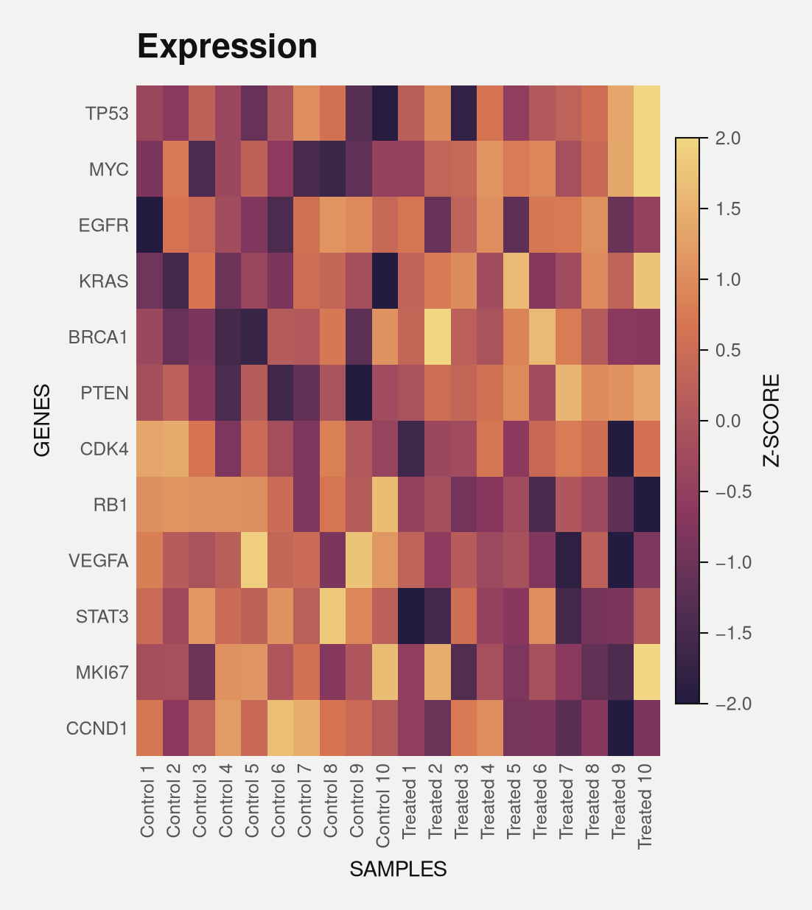<br><code>heatmap</code></td>
    <td align="center">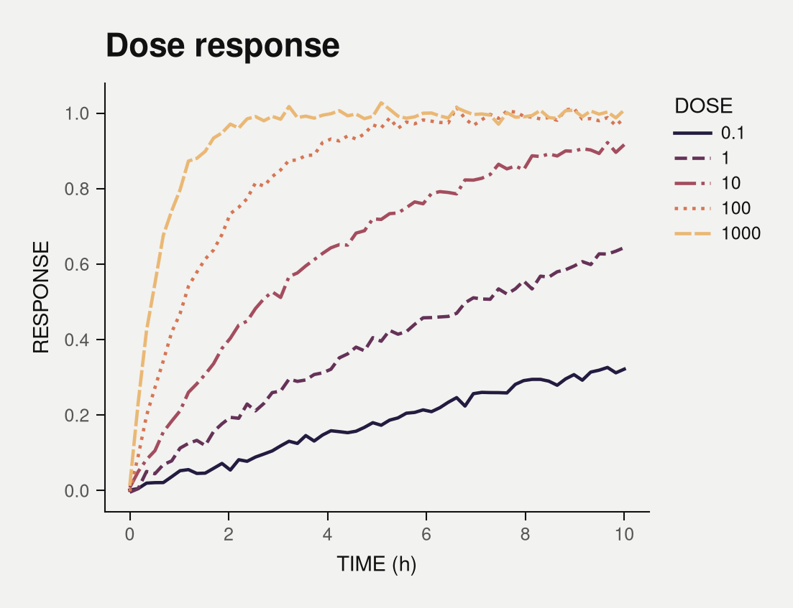<br><code>line</code> (ordered hue)</td>
  </tr>
  <tr>
    <td align="center">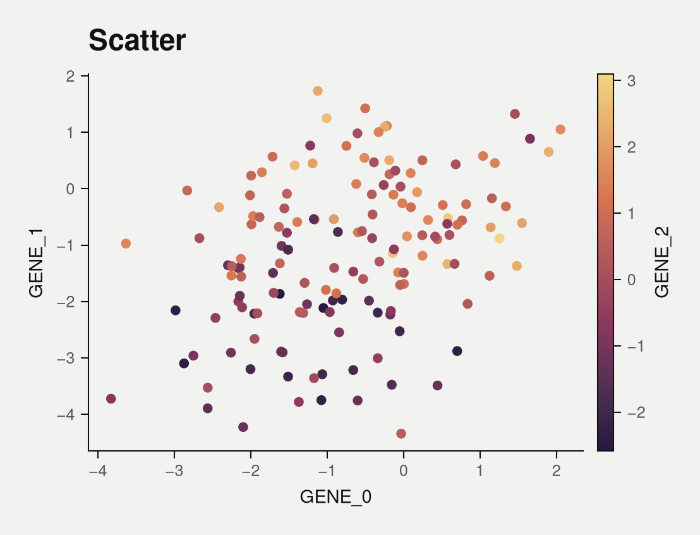<br><code>scatter</code> (gradient color)</td>
    <td align="center">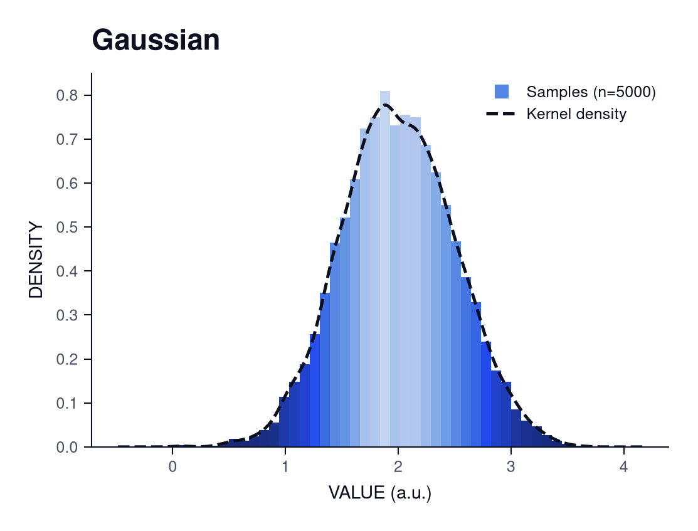<br>same call, <code>style="cobalt"</code></td>
    <td align="center">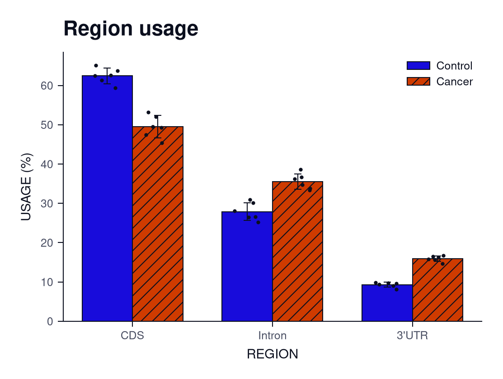<br><code>style="cobalt"</code></td>
  </tr>
</table>

The data in the gallery is synthetic (`plotkit.synthetic`). The UMAP clusters are tighter and better separated than real data would be.

## Plot reference

| Call | `data` | Options |
|---|---|---|
| `continuous` | 1-D values (list, array, Series), or a table whose column matches `x_name` | `bins=40`, `fit="kde"` (`"kde"`, `"normal"`, `None`) |
| `boxplot` | table with a group column and a value column, or `{group: values}` | `order=None`, `points=False` |
| `bar` | table with a category column and a value column | `hue=None`, `error="sd"` (`"sd"`, `"sem"`, `None`), `points=True` |
| `scatter` | table with x and y columns | `hue=None` (category), `color=None` (numeric column, gradient + colorbar), `s=14`, `alpha=None` (number, column name, per-point array or `f(x, y)`), `marginals=False` (`True`: a KDE per hue level above and beside the axes) |
| `line` | table with x and y columns | `hue=None`, `ordered=False` (ordinal hue such as dose), `markers=False` |
| `dim_red` | coordinate columns, or a feature table when `method` is set | `hue=None` (a column name; with `method` set it must be one), `method=None` (`"pca"`, `"umap"`), `n_neighbors=15`, `min_dist=0.3`, `seed=0`, `s=10`, `alpha=None` (as in `scatter`), `marginals=False` (as in `scatter`; drops the equal-scale rule) |
| `survival` | table with time, event (1 = event, 0 = censored) and group columns | `time="time"`, `event="event"`, `group="group"` (a missing default group column gives one curve; a group column you name that does not exist raises `DataError`) |
| `volcano` | table with log2 fold change and p-value columns | `lfc="log2fc"`, `p="pvalue"`, `lfc_cut=1.0`, `p_cut=0.01` |
| `heatmap` | wide table: rows are features, columns are samples, optional leading label column | `zscore=True`, `cbar_label=None`, `vmin=None`, `vmax=None` (fixed color range), `annotate=False` (print cell values) |

Options common to every call:

| Option | Meaning |
|---|---|
| `style` | `"editorial"` (default), `"cobalt"`, or a `Variant` |
| `size` | `"single"` (3.5 in), `"double"` (7.2 in) or `(width, height)` in inches |
| `aspect` | width / height; each plot has its own default |
| `x`, `y` | column names, when they differ from the axis labels |
| `ax` | draw into an existing matplotlib axes |
| `subtitle` | extra line(s) under the title: regular weight, muted, one level below it; off by default |
| `caption` | note centered below the whole figure, wrapped to its width; off by default |
| `save` | path without suffix; writes a PNG (use `result.save(path, formats=..., dpi=...)` for others) |
| `xlim`, `ylim` | `(low, high)` axis limits, e.g. `ylim=(0.5, 1)` for a score bounded by 1 so small differences stay small |

Every function has explicit, typed keyword-only options, so editors complete them and mypy checks them; an unknown option raises `TypeError`. Bad option values (`error="se"`, `order=["nope"]`, `size="triple"`) raise `DataError` or `ValueError` naming the valid choices. Groups and categories use the categorical palette, which holds at most 5 colours; more raises `PaletteError` (group rare categories or use facets).

`plotkit.synthetic` provides demo data for every plot: `gaussian`, `groups`, `region_usage`, `expression`, `single_cells`, `differential_expression`, `survival_data`, `expression_matrix`, `dose_response`.

## Styles

A style bundles a page colour, ink colours, a theme and three palettes:

| Palette | Use | Property |
|---|---|---|
| Continuous | heatmaps, gradient fills, value-encoding colour | smooth gradient, lightness changes monotonically |
| Discrete (3 to 9 steps) | ordered data such as doses | sampled from the gradient |
| Categorical (up to 5) | unordered groups | each colour has at least 3:1 contrast on the page |

| Style | Page | Character |
|---|---|---|
| `editorial` (default) | warm gray `#F2F2F0` | orange lead; violet, magenta, orange, yellow gradient |
| `cobalt` | white (journal-safe) | electric cobalt lead; navy to ice-blue gradient |

Rules that hold for every style, checked by [`design/variants/validate.py`](design/variants/validate.py) (107 checks):

- Distinguishable under deuteranopia, protanopia and tritanopia simulation, and in grayscale.
- Gradients keep strictly monotonic lightness in all of those conditions.
- Text and axes have at least 4.5:1 contrast against the page.
- Colour is never the only cue: groups also differ by marker shape, line style or hatching.

Warm yellow cannot reach 3:1 contrast on a light page, so in the categorical palettes it appears as ochre. It is still used in the editorial gradient. Keeping the gradients colour-blind safe also reduced their saturation (editorial runs at 68% of the designed chroma).

Fonts: Helvetica when installed, then Nimbus Sans, Arial, Liberation Sans and DejaVu Sans. Mathtext uses Computer Modern.

## Data: pandas and polars

All input conversion happens in one place, `plotkit.data.DataAdapter`. Pass a pandas `DataFrame`/`Series`, a polars `DataFrame`/`LazyFrame`/`Series`, a dict, or an array-like. polars is never imported by plotkit; it is detected by its type, so everything works without it installed. A polars input and the same pandas input produce pixel-identical figures (this is tested for every plot).

Polars `Categorical` columns arrive as plain strings, so category order is not preserved.

## Saving and customizing

```python
result = plotkit.scatter("gene_0", "gene_1", "Scatter", syn.expression(), hue="group")

result.ax.set_xlim(-5, 5)  # keep customizing with matplotlib
result.save("out/scatter")  # PNG; add formats=("pdf", "svg"), dpi=600 for more
```

`save` writes a PNG, cropped to the drawn content and padded exactly 0.15 in on every side. For other formats or resolution call `result.save(path, formats=("pdf", "svg", "png"), dpi=600)`. A trailing image suffix in the path is replaced (`"out/fig.png"` and `"out/fig"` are the same); other dots stay in the name (`"out/fig_0.5"` writes `fig_0.5.png`). PDF embeds TrueType fonts (type 42). SVG stores text as paths, so it renders the same everywhere but the text is not editable. For lower-level control, use `plotkit.save_figure(fig, path, formats=("pdf", "png"), dpi=600, pad_inches=0.2)`.

Fonts are resolved when a figure is drawn, so draw and save inside the plot's theme. `result.save()`, `result.overlaps()` and `result.to_array()` do this for you. If you call `result.fig.savefig(...)` yourself, wrap it:

```python
with result.context():
    result.fig.savefig("out/figure.png", dpi=300)
```

Importing plotkit never changes matplotlib's global settings; themes are applied per plot with `rc_context`.

Legends are placed automatically: plotkit tests every inside position against the plotted lines, points, bars and images and picks one that covers nothing. If none is free, the legend goes outside on the right. `result.overlaps()` reports colliding titles, labels and legends.

## Extending plotkit

### A new plot: one class, one decorator

```python
import plotkit
from plotkit.data import DataAdapter


@plotkit.register_plot("lollipop")
class Lollipop(plotkit.BasePlot):
    def prepare_data(self):
        return DataAdapter.normalize(self.data, x=self.xcol, y=self.ycol).frame

    def draw(self, ax, d):
        ax.vlines(d["x"], 0, d["y"], color=self.v.fg, lw=self.v.hairline)
        ax.scatter(d["x"], d["y"], color=self.v.categorical(1).colors[0], zorder=3)


plotkit.plot("lollipop", "Gene", "Score", "Top genes", df, x="gene", y="score")
```

`BasePlot` runs `prepare_data()`, `draw()`, `style_axes()`, `style_legend()` and `finalize()` in that order; override any of them. Declare options as a class attribute (`defaults = {"my_option": 1}`) and read them from `self.opt`. `self.v` is the style: `self.v.fg`, `self.v.bg`, `self.v.muted`, `self.v.hairline`, `self.v.categorical(n)`, `self.v.continuous()`, `self.v.discrete(n)`. Axis labels, title, legend placement, size, `save=` and the theme come for free.

### A new style: one object, one call

```python
mine = plotkit.Variant(
    name="mint",
    bg="#F4F8F6",
    fg="#0E1A16",
    muted="#46544E",
    categorical_hex=("#0B6E4F", "#C2410C", "#5B21B6", "#8A6D00", "#1C1C1C"),
    gradient_hex=("#10251D", "#0B6E4F", "#6FCF97", "#E8F6EE"),  # dark to light
)
plotkit.register_variant(mine)

plotkit.boxplot("Group", "Value", "Quantiles", data, style="mint")
```

`register_variant` also registers a theme and three palettes under the same name (`get_theme("mint")`, `get_palette("mint-categorical")`). A new style is not checked for colour-blind safety automatically. Run it through [`design/variants/validate.py`](design/variants/validate.py) (and see `design/variants/common.py` for the gradient builder that enforces monotonic lightness).

Registries (`plots`, `variants`, themes, palettes) also load third-party entry points from the groups `plotkit.plots`, `plotkit.styles`, `plotkit.themes` and `plotkit.palettes`, so a separate package can add plots or styles without touching plotkit.

### Lower-level building blocks

If you draw with matplotlib directly, you can still use the pieces:

```python
import plotkit
from matplotlib.figure import Figure
from plotkit.components import SINGLE_COLUMN, AxisFormatter, LegendStyler, TitleFormatter
from plotkit.themes import get_variant

v = get_variant("editorial")
with v.theme().context():
    fig = Figure(figsize=SINGLE_COLUMN.figsize())
    ax = fig.subplots()
    ax.plot([0, 1, 2], [0, 1, 4], label="y = x²")
    AxisFormatter("Time (s)", "Distance (m)", upper=True).apply(ax)
    TitleFormatter("Motion").apply(ax)
    LegendStyler().apply(ax)
    plotkit.save_figure(fig, "out/custom")
```

## Design rules

- Sizes derive from one base (axis labels, 7 pt) on a 1.125 type scale: tick and legend text one step down, titles larger and bold. Text never goes below 5 pt.
- Axes and ticks are 0.5 pt hairlines. Data lines are about twice as heavy so the data leads.
- Marks are flat and crisp. Gradients are used only where colour encodes a value.
- Single column is 3.5 in wide, double column 7.2 in.

## Development

```bash
uv sync --extra dev --extra polars --extra umap
uv run ruff check . && uv run ruff format --check . && uv run mypy && uv run pytest
uv run python main.py            # regenerate the gallery (editorial)
uv run python main.py cobalt     # ... or the cobalt style
```

Layout:

```
src/plotkit/
  api.py            one-call functions (typed signatures; kept in sync with each plot's `defaults` by a test)
  plots/            BasePlot template, one file per plot, registry
  palettes/         continuous, discrete, categorical + registry
  themes/           PublicationTheme, styles (Variant), built-in editorial and cobalt
  components/       axis, title, legend (auto placement), colorbar, size presets, overlap checks
  data/adapter.py   the only code that knows about pandas vs polars
  io/export.py      save_figure
  synthetic.py      demo data
design/variants/    colour design and validation tools
tools/              reference-image colour extraction
```

Contribution guidelines are in [CONTRIBUTING.md](CONTRIBUTING.md); conventions for coding agents are in [CLAUDE.md](CLAUDE.md).

## Limitations

- CI runs lint, format and mypy on Python 3.12 and the tests on 3.10 to 3.13, with a 90% coverage floor. plotkit supports pandas 2 and 3; tests compare datetimes at nanosecond resolution because the default unit differs between them.
- Real Helvetica and `usetex` rendering are untested on this machine (no TeX install; Nimbus Sans stands in for Helvetica). `usetex` is off by default and raises `ThemeError` with a clear message when TeX is missing.
- If text overhangs the canvas because of unusually small layout padding, the cropped output can have a slightly smaller right margin than the other sides.
- The `editorial` and `cobalt` styles are validated for categorical palettes of up to 5 colours and discrete palettes of 3 to 9 steps.
- Out of scope for v0.1: interactive plots, 3D plots, other plotting backends, a command-line interface. The extension points above (registered plots, styles and entry points) are where those would attach.
