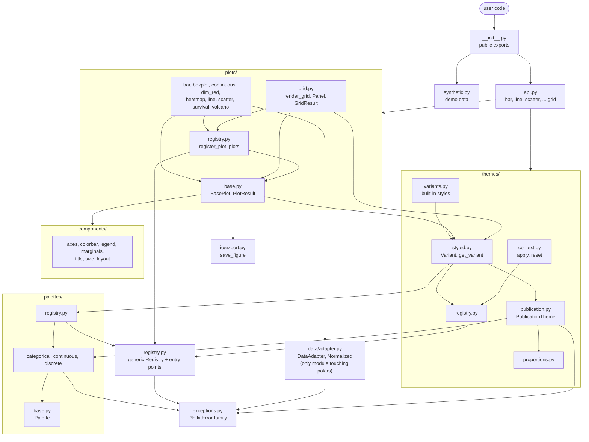
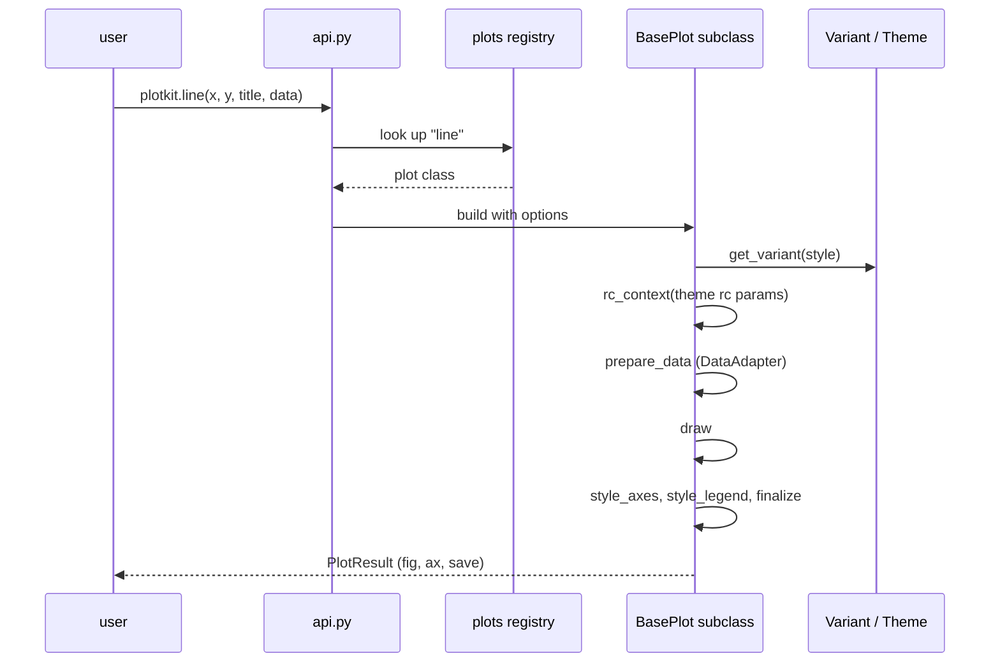

# plotkit source layout

How the library is built. Arrows read "depends on" (imports).

## Render pipeline

Every plot is a `BasePlot` subclass. `render()` runs the template inside `matplotlib.rc_context`, so plotkit never changes matplotlib global state.

## Rules of the layout

- `data/adapter.py` is the only module that touches polars. Everything else takes pandas.
- Importing plotkit never mutates matplotlib global state. Styling goes through `rc_context`.
- `registry.py` is the one generic `Registry`. Palettes, themes and plots each own an instance. Unknown names fall back to entry points.
- Extension = one new file plus one `register_*` call (`register_palette`, `register_theme`, `register_variant`, `register_plot`).
- All errors derive from `PlotkitError` (`exceptions.py`).
